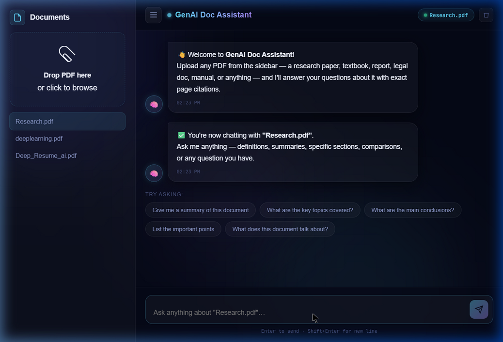

# GenAI Doc Assistant (RAG Chatbot)

A powerful, Retrieval-Augmented Generation (RAG) chatbot and document assistant. It allows users to upload PDF documents, parses and embeds their contents into a vector database, and uses a Large Language Model (LLM) to accurately answer natural language questions about the documents with citations.



## Architecture Overview

The application follows a clean, decoupled Client-Server architecture:

1.  **Frontend (React/Vite):** A dark-themed, highly responsive UI. Handles file uploads, dynamically displays indexed documents, and provides an intuitive chat interface.
2.  **API Backend (FastAPI):** Exposes RESTful endpoints for document upload, indexing, and chat inference. 
3.  **Vector Database (ChromaDB):** Operates entirely locally. Slices PDF documents into overlapping chunks and stores their semantic embeddings.
4.  **Inference Engine (Groq / Llama 3):** Powers the reasoning step by using the retrieved text chunks to generate highly specific and accurate answers.

## Tech Choices and Why

*   **Frontend:** `React` with `Vite`. Vite provides lightning-fast HMR and build times compared to old bundlers. React allows for highly state-driven chat interfaces.
*   **Backend:** `Python` and `FastAPI`. Python is the absolute standard for AI/ML tasks due to its ecosystem. FastAPI provides massive speed, minimal boilerplate, and automatic OpenAPI documentation.
*   **Vector Database:** `ChromaDB`. Extremely lightweight, open-source, and runs locally without overhead or expensive cloud instances.
*   **Embeddings:** `sentence-transformers` (`all-MiniLM-L6-v2`). A small, blazing-fast, and open-source embedding model that produces fantastic contextual sentence representations entirely edge-side.
*   **LLM Provider:** `Groq` with `llama-3.1-8b-instant`. Groq's LPU architecture provides unmatched, near-instantaneous inference speeds for Open Source top-tier models like Llama-3.1.
*   **Document Parsing:** `PyMuPDF`. Handles complex layouts, fast extraction, and is typically more reliable for heavily structured PDFs than classic PyPDF2.

## Setup Instructions

### Prerequisites
- Python 3.9+
- Node.js 18+

### 1. Environment Variables Configuration
Ensure an `.env` file exists at the root of the project with the following configuration:
```env
GROQ_API_KEY=your_groq_api_key_here
CHUNK_SIZE=400
CHUNK_OVERLAP=50
TOP_K=4
EMBEDDING_MODEL=all-MiniLM-L6-v2
LLM_MODEL=llama-3.1-8b-instant
CHROMA_DB_PATH=./chroma_db
VITE_API_URL=http://localhost:8000
```

### 2. Backend Setup
1. Open a terminal and navigate to the project root.
2. Create and activate a Virtual Environment if you haven't (Recommended).
   ```bash
   python -m venv venv
   # On Windows
   venv\Scripts\activate 
   # On Mac/Linux
   source venv/bin/activate
   ```
3. Install the dependencies:
   ```bash
   cd backend
   pip install -r requirements.txt
   ```
4. Start the FastAPI server:
   ```bash
   uvicorn app.main:app --host 0.0.0.0 --port 8000
   # or simply `python -m uvicorn app.main:app`
   ```

### 3. Frontend Setup
1. Open a second terminal and navigate to the frontend folder.
   ```bash
   cd frontend
   ```
2. Install dependencies:
   ```bash
   npm install
   ```
3. Start the Vite development server:
   ```bash
   npm run dev
   ```
4. Visit `http://localhost:5173` in your browser.

## Known Limitations

- **File Formats:** Currently, the platform strictly only supports `.pdf` document extraction. It does not accept `.docx`, `.txt`, or raw images without translation.
- **State Persistence:** The chat interface does not persist historical conversations between page reloads; only the documents remain in the vector index.
- **In-Memory Limitations:** The chunking context size (`CHUNK_SIZE = 400`) might cut off long, sprawling paragraphs, leading to slightly disconnected retrieval items for highly dense texts.
- **Concurrent Uploads:** Extremely massive PDF uploads might lock up the FastAPI thread temporarily while the heavy chunks are generated and dumped into ChromaDB depending on the local hardware limitations.
